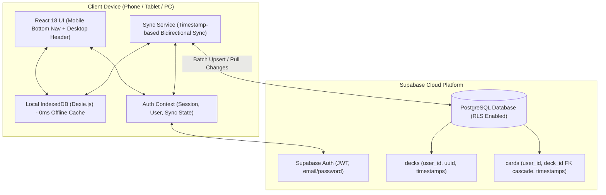

# Implementation Plan: Supabase Auth, Cloud Sync & Mobile-First Adaptation

Implement user profiles, cloud storage with **Supabase (PostgreSQL)** for cross-device synchronization, offline-first IndexedDB persistence, a mobile/tablet native bottom navigation bar, and full mobile optimization.

---

## 1. Goal Description

Currently, LingoCards stores all decks and cards exclusively in the browser's local **IndexedDB**. If a user switches from their phone to a PC or tablet, their progress cannot be accessed. Furthermore:
* There are no user accounts, authentication, or cloud backups.
* The mobile layout requires vertical scrolling during study and lacks native-like mobile navigation.
* The application needs PWA readiness so it can be installed on iOS and Android home screens.

This project will introduce:
1. **Supabase Authentication**: Email/Password login, signup, session persistence, and guest-to-account migration.
2. **Relational Cloud Storage (PostgreSQL)**: Decks and cards tables protected by Row Level Security (RLS) with cascade deletes.
3. **Offline-First Bidirectional Sync Engine**: Changes write immediately to local IndexedDB (Dexie) for 0ms offline speed, and sync seamlessly with Supabase in the background when connected.
4. **Mobile & Tablet Native Bottom Navigation**: App-style bottom navigation bar (`Decks`, `Study Due`, `Profile / Sync`), compact safe-area header, and zero-scroll study session.
5. **PWA Foundation**: Web App Manifest, theme-color metadata, and mobile safe-area insets.

---

## 2. System Architecture



---

## 3. User Review Required

> [!IMPORTANT]
> **Supabase Project Credentials**:
> To connect to Supabase, you will create a free project at [supabase.com](https://supabase.com) and provide two environment variables in a `.env.local` file:
> * `VITE_SUPABASE_URL`
> * `VITE_SUPABASE_ANON_KEY`
> *We will provide the exact SQL script to copy-paste into the Supabase SQL Editor to set up the tables and Row Level Security in one click.*

> [!NOTE]
> **Guest / Offline Mode First**:
> Users will NOT be forced to log in to use the app. Unauthenticated users can create decks and study offline as they do today. When they sign up or log in, their local decks will automatically merge into their new cloud account!

---

## 4. Proposed Changes

### Component 1: Dependencies & Supabase Client Setup

#### [MODIFY] package.json
* Add `@supabase/supabase-js` to dependencies.

#### [NEW] src/lib/supabase.ts
* Initialize the Supabase client using Vite environment variables (`import.meta.env.VITE_SUPABASE_URL`, `import.meta.env.VITE_SUPABASE_ANON_KEY`).
* Graceful fallback if credentials are not yet entered (app runs in local-only guest mode without throwing errors).

#### [NEW] .env.example
* Provide template variables:
  ```env
  VITE_SUPABASE_URL=https://your-project.supabase.co
  VITE_SUPABASE_ANON_KEY=your-anon-key
  ```

---

### Component 2: Cloud SQL Schema (Supabase)

#### [NEW] supabase_schema.sql
A ready-to-run SQL migration script for the user's Supabase project:
```sql
-- 1. Decks table
CREATE TABLE public.decks (
    id UUID PRIMARY KEY DEFAULT gen_random_uuid(),
    user_id UUID NOT NULL REFERENCES auth.users(id) ON DELETE CASCADE,
    title TEXT NOT NULL,
    description TEXT,
    target_language TEXT NOT NULL,
    native_language TEXT NOT NULL DEFAULT 'English',
    color TEXT NOT NULL DEFAULT 'emerald',
    created_at BIGINT NOT NULL,
    updated_at BIGINT NOT NULL,
    is_deleted BOOLEAN NOT NULL DEFAULT FALSE
);

-- 2. Cards table (with foreign key cascade)
CREATE TABLE public.cards (
    id UUID PRIMARY KEY DEFAULT gen_random_uuid(),
    deck_id UUID NOT NULL REFERENCES public.decks(id) ON DELETE CASCADE,
    user_id UUID NOT NULL REFERENCES auth.users(id) ON DELETE CASCADE,
    front TEXT NOT NULL,
    back TEXT NOT NULL,
    notes TEXT,
    level SMALLINT NOT NULL DEFAULT 0,
    consecutive_correct INT NOT NULL DEFAULT 0,
    interval_days INT NOT NULL DEFAULT 0,
    ease_factor NUMERIC(4,2) NOT NULL DEFAULT 2.50,
    next_review_date BIGINT NOT NULL,
    last_reviewed_date BIGINT,
    total_reviews INT NOT NULL DEFAULT 0,
    created_at BIGINT NOT NULL,
    updated_at BIGINT NOT NULL,
    is_deleted BOOLEAN NOT NULL DEFAULT FALSE
);

-- 3. Row Level Security (RLS)
ALTER TABLE public.decks ENABLE ROW LEVEL SECURITY;
ALTER TABLE public.cards ENABLE ROW LEVEL SECURITY;

CREATE POLICY "Users can manage own decks" ON public.decks
    FOR ALL USING (auth.uid() = user_id);

CREATE POLICY "Users can manage own cards" ON public.cards
    FOR ALL USING (auth.uid() = user_id);

-- 4. Fast sync indexing
CREATE INDEX idx_decks_user_updated ON public.decks(user_id, updated_at);
CREATE INDEX idx_cards_user_updated ON public.cards(user_id, updated_at);
CREATE INDEX idx_cards_deck_id ON public.cards(deck_id);
```

---

### Component 3: Data Types & Dexie Schema Updates

#### [MODIFY] src/types/index.ts
* Update `Deck` and `Card` models:
  * Change `id` from auto-increment number to UUID string (`string`).
  * Add `userId?: string`.
  * Add `isDeleted?: boolean` (soft-delete for reliable offline sync propagation).
  * Add sync state types: `SyncStatus = 'synced' | 'pending' | 'syncing' | 'error'`.
  * Add User Profile interface (`UserProfile`).

#### [MODIFY] src/db/db.ts
* Update Dexie schema to version 2:
  * Table primary keys updated to `id` (UUID strings, generated via `crypto.randomUUID()`).
  * Add index on `updatedAt`, `isDeleted`.
  * Support soft-deleting (`isDeleted: true`) so deletions sync to other devices.
  * Provide helper for batch upserts during sync.

---

### Component 4: Authentication & Sync Engine

#### [NEW] src/context/AuthContext.tsx
* Expose `useAuth()` hook:
  * `user`: Current Supabase User or null.
  * `signIn(email, password)`, `signUp(email, password)`, `signOut()`.
  * `syncStatus`: Current sync state (`synced`, `syncing`, `offline`, `error`).
  * `lastSyncedAt`: Timestamp of last sync.
  * `syncNow()`: Trigger immediate manual sync.

#### [NEW] src/services/syncService.ts
* **Bidirectional Sync Algorithm**:
  1. **Upload Local Changes**: Query Dexie for records where `updatedAt > last_sync_time`. Push to Supabase via batch `upsert`.
  2. **Download Remote Changes**: Fetch records from Supabase where `updated_at > last_sync_time`. Upsert into Dexie.
  3. **Deleted Records**: Soft-deleted records on either side are removed or marked in Dexie.
  4. **Initial Cloud Sync (Guest Merge)**: On first login, if the user already has local decks created as a guest, automatically assign their new `user_id` and upload them to the cloud.

---

### Component 5: UI Views & Native-Like Navigation

#### [NEW] src/components/AuthModal.tsx
* Clean modal/bottom-sheet for:
  * Sign in with email & password.
  * Sign up with email & password.
  * Switch between Sign In / Sign Up tabs.
  * Display friendly status messages.

#### [NEW] src/components/ProfileView.tsx
* User account overview:
  * User email, joined date.
  * Cloud sync status: "All changes backed up to cloud" badge, last synced time, and **Sync Now** button.
  * Device stats: Total decks & cards stored locally vs cloud.
  * Log out button.
  * Guest prompt if not logged in: "Sign in to sync across your phone, tablet, and PC."

#### [NEW] src/components/BottomNav.tsx
* Mobile & tablet bottom tab bar:
  * **Decks** (Dashboard icon)
  * **Study Due** (Cards badge with number of due cards)
  * **Profile** (User avatar / Sync indicator badge)
* Fixed to bottom of screen with `pb-safe` (iPhone home indicator spacing).

#### [MODIFY] src/components/Navbar.tsx
* Display user avatar/email when logged in with a sync status icon (Cloud checkmark).
* On mobile: Keep header sleek and compact; bottom nav handles tab switching.
* On desktop: Provide direct Profile / Login button in header.

#### [MODIFY] src/App.tsx
* Wrap with `AuthProvider`.
* Support `'profile'` view in `view` state machine.
* Render `BottomNav` on mobile/tablet screens.
* Listen to `online` / `offline` browser events to trigger sync automatically.

---

### Component 6: Mobile Phone Adaptation & PWA Readiness

#### [NEW] public/manifest.webmanifest
* Standalone PWA manifest with portrait orientation and theme colors.

#### [NEW] public/icon.svg
* Scalable SVG app icon.

#### [MODIFY] index.html
* `viewport-fit=cover`, mobile web app tags, theme-color matching.

#### [MODIFY] src/index.css
* Safe area utilities (`pt-safe`, `pb-safe`), touch manipulation, tap-highlight removal.

#### [MODIFY] src/components/StudySession.tsx
* Zero-scroll mobile card height (`h-[46vh] min-h-[260px] max-h-[420px]`).
* Ergonomic thumb-zone rating buttons pinned to the bottom.

#### [MODIFY] Modals (DeckModal.tsx, CardModal.tsx, etc.)
* Bottom sheet layout on mobile (`rounded-t-3xl pb-safe`).
* 16px minimum font size on inputs to eliminate iOS Safari auto-zoom.

---

## 5. Verification Plan

### Automated Checks
* Install `@supabase/supabase-js` and run `npx tsc --noEmit` and `npm run build` to verify clean compilation.

### Manual Verification
1. **Offline & Guest Mode**:
   * Create decks and cards without logging in.
   * Verify all study and spaced repetition features work as expected.
2. **Authentication**:
   * Sign up a new user with email & password.
   * Verify user session persists on page refresh.
3. **Cloud Sync & Device Switching**:
   * Verify local decks are uploaded to Supabase upon login.
   * Open the app in an Incognito window (simulating a second device), log into the same account, and verify all decks & cards download and appear instantly.
   * Review cards on one device, trigger sync, and observe updated mastery levels and intervals on the other device.
4. **Mobile Responsiveness & Bottom Navigation**:
   * Emulate iPhone SE and iPhone 14 Pro: verify bottom navigation, zero-scroll study session, and bottom-sheet modals.
   * Verify PWA manifest loads correctly in Chrome DevTools Application tab.
